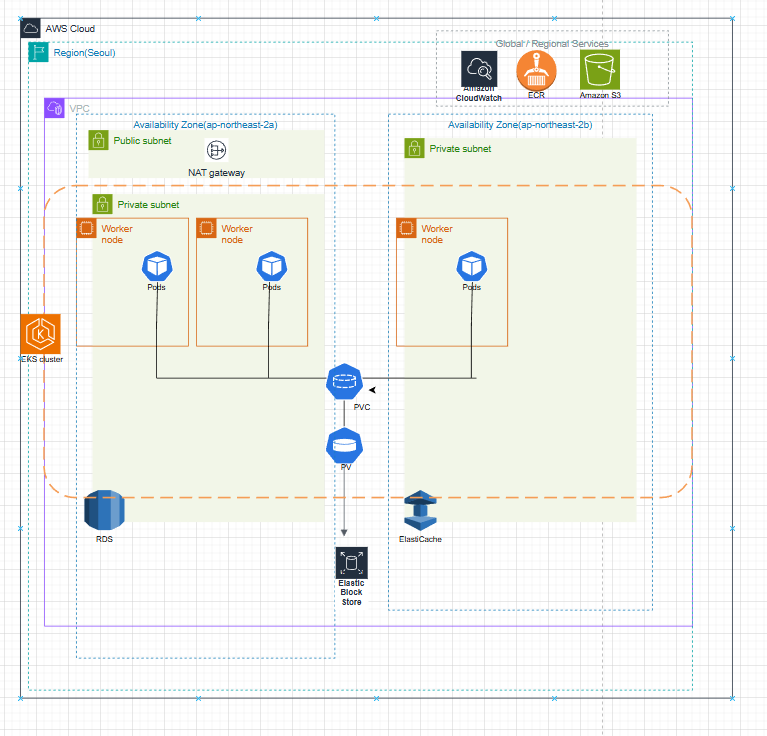
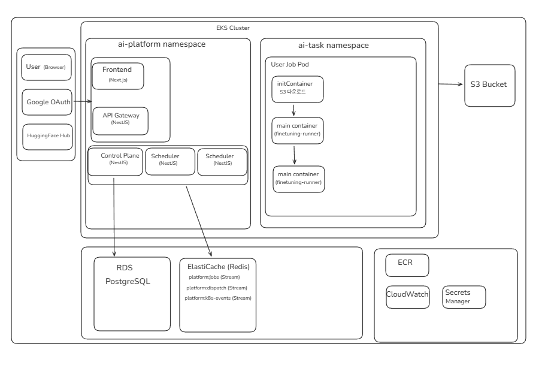
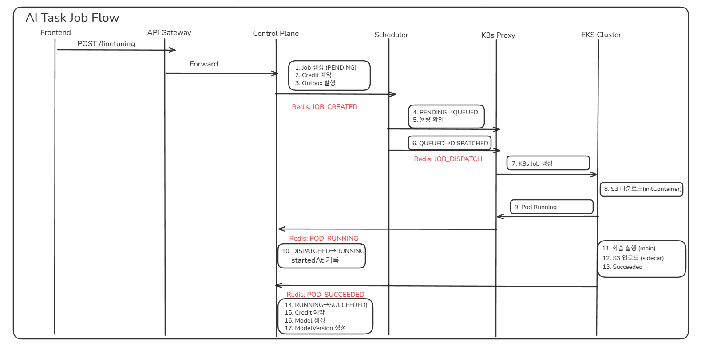
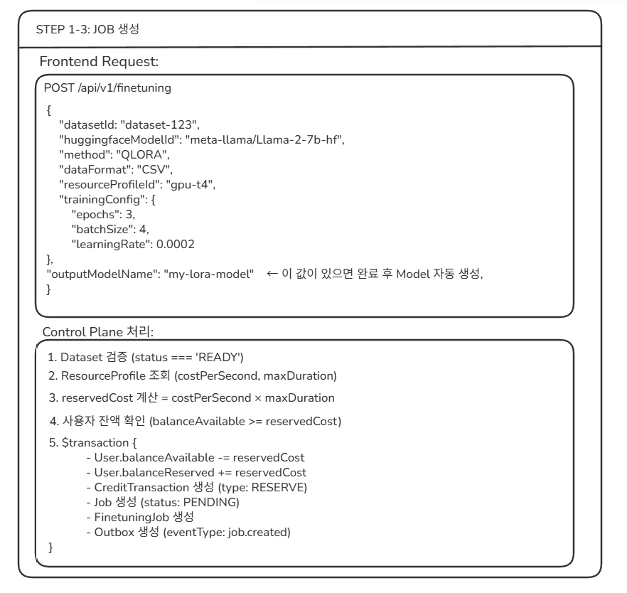
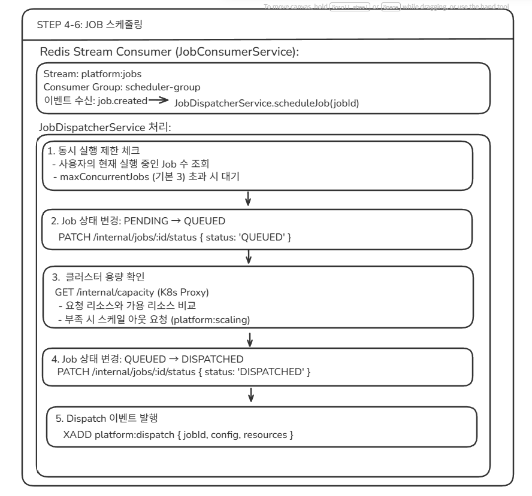
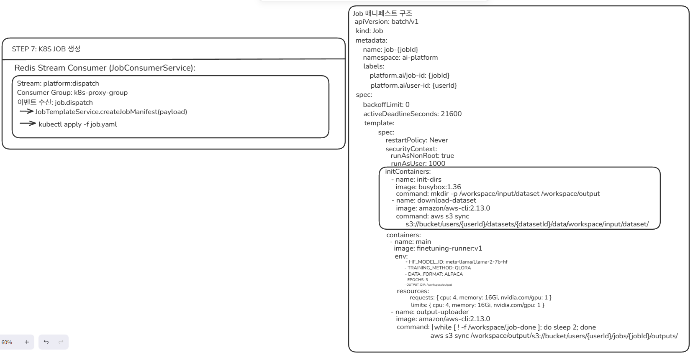
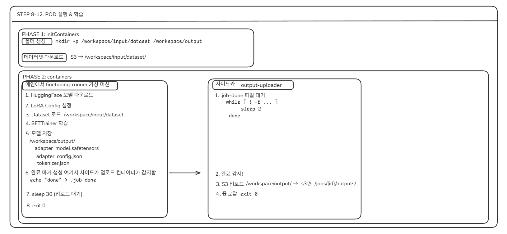
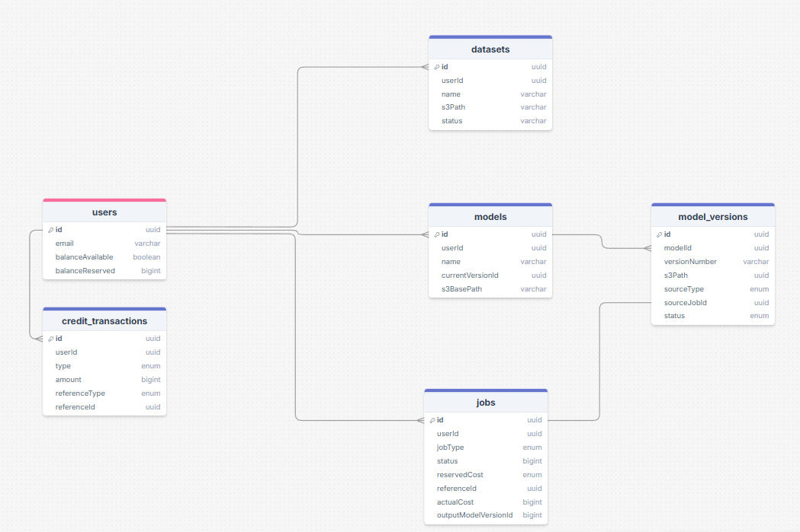

# Worldland AI Task Job Architecture

본 저장소는 GPU 기반 AI 파인튜닝/추론 작업을 안정적으로 실행하기 위한
**Control Plane + Scheduler + Kubernetes Job Orchestration + 정합성 있는 과금(Accounting) 시스템**의 전체 아키텍처 설계를 정리한 기술 문서입니다.

단순한 AI 학습 서버 보다는 아니라, 다음 문제를 해결하는 것을 목표로 하고 있습니다.

* 사용자별 동시 실행 제한 및 공정한 자원 스케줄링
* GPU 리소스 가용성 기반 디스패치
* Job 상태 머신의 일관성 있는 전이
* 실패 복구 가능한 이벤트 기반 오케스트레이션
* 금융 시스템 수준의 크레딧 예약·차감 정합성
* 학습 결과(Model Artifact)의 재현 가능하고 추적 가능한 라이프사이클 관리

---

## 1. 전체 인프라 구조 (AWS + EKS)



* AWS Region: ap-northeast-2 (Seoul)
* VPC + Multi-AZ 구성
* EKS Cluster (GPU Worker Nodes)
* RDS (PostgreSQL): 메타데이터 및 크레딧 원장
* ElastiCache (Redis Streams): 이벤트 스트림 및 스케줄링 큐
* S3: Dataset 및 Model Artifact 저장소
* ECR / CloudWatch / Secrets Manager 연동

각 Job은 Kubernetes Job 단위로 격리 실행되며, 데이터는 S3–PVC–Pod 간 파이프라인으로 이동합니다다.

---

## 2. Control Plane & Namespace 분리



### ai-platform namespace

* Frontend (Next.js)
* API Gateway (NestJS)
* Control Plane (NestJS)
* Scheduler (NestJS)
* K8s Proxy (Job Manifest 생성 및 Apply)

### ai-task namespace

* 사용자별 K8s Job
* Init Container: Dataset 다운로드
* Main Container: Finetuning Runner
* Sidecar: 결과 업로드

Control Plane은 **상태 머신과 트랜잭션 정합성**을 담당하고,
실제 실행은 K8s가 담당하는 구조로 역할을 명확히 분리하였습니다.

---

## 3. Job 상태 머신 & 이벤트 흐름



Job은 다음 상태 전이를 따른다.

```
PENDING → QUEUED → DISPATCHED → RUNNING → SUCCEEDED / FAILED
```

모든 상태 전이는 Redis Stream 이벤트와 DB 트랜잭션을 통해 원자적으로 관리됩니다.

* job.created
* job.dispatched
* pod.running
* pod.succeeded / failed

Control Plane은 이를 **Replicated State Machine**처럼 관리합니다.

---
## 4. Job 생성 단계: Control Plane 트랜잭션



사용자가 `POST /api/v1/finetuning` 요청을 보내면 Control Plane은
Kubernetes 리소스를 생성하기 전에 다음 과정을 **단일 DB 트랜잭션**으로 처리합니다.
이는 크레딧 과다 차감 방지와 이벤트 발행의 원자성을 보장합니다.

1. Dataset 상태 검증 (`status = READY`)
2. ResourceProfile 조회 및 실행 비용 산정 (`reservedCost = costPerSecond × maxDuration`)
3. 사용자 크레딧 예약

   * `balanceAvailable` 감소
   * `balanceReserved` 증가
4. 크레딧 원장 기록

   * `CreditTransaction(type = RESERVE)` 생성
5. Job 엔티티 생성

   * `status = PENDING`
6. Outbox 이벤트 기록

   * `eventType = job.created`

이 단계에서 Job은 아직 스케줄링되지 않았으며,
이후 Scheduler가 Redis Stream의 `job.created` 이벤트를 소비하여
큐잉 및 디스패치 단계로 상태를 전이합니다.

## 5. 스케줄러 설계 (Capacity-aware Dispatch)



Scheduler는 다음을 보장한다.

1. 사용자 동시 실행 제한 (Fairness)
2. GPU 가용 리소스 기반 배치
3. Backpressure (큐잉)
4. Idempotent 재처리

Redis Stream Consumer Group을 이용해 **Exactly-once Dispatch Semantics**를 구현했습니다다.

---

## 6. Job Manifest 구조



* GPU 리소스 요청
* Non-root 실행
* InitContainer / Main / Sidecar 분리
* ActiveDeadlineSeconds 기반 실행 제한
* Backoff 없는 Deterministic Failure Model

---

## 7. Kubernetes Job 실행 모델



### Init Containers

* Dataset S3 → `/workspace/input`

### Main Container

* HuggingFace Model Download
* LoRA / QLoRA 설정
* SFTTrainer 실행
* `/workspace/output` 에 결과 저장

### Sidecar

* 완료 마커 감시
* 결과 S3 업로드
* Job 종료 시점 동기화

이는 단순 배치 작업이 아닌, **재현 가능한 ML 파이프라인** 구조입니다.

---

## 8. DB 스키마 & 크레딧 정합성



* balanceAvailable
* balanceReserved
* CreditTransaction (RESERVE / COMMIT / REFUND)
* Job.reservedCost / actualCost
---
